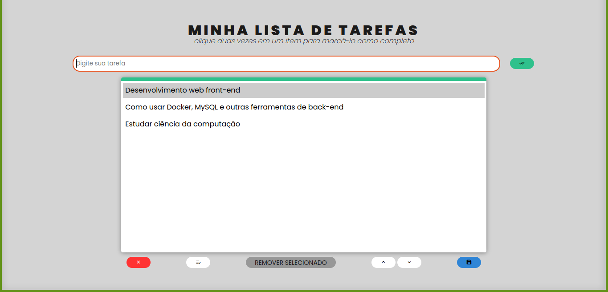

# Boas vindas ao repositório do projeto Lista de Tarefas!

### Veja a aplicação em: https://todo-list-psi-five.vercel.app/

---

# Sumário

- [Habilidades](#habilidades)
- [Entregáveis](#entregáveis)
  - [O que foi desenvolvido](#o-que-deverá-ser-desenvolvido)
  - [Desenvolvimento](#desenvolvimento)

# Habilidades

- Manipular CSS

- Manipular Javascript

- Manipulação de Local Storage

--- 

## O que foi desenvolvido

- Uma lista de tarefas usando `HTML`, `CSS` e `JavaScript`.

---

## Desenvolvimento

  * [Javascript.com](http://javascript.com/)

  * [W3Schools](https://www.w3schools.com/js/default.asp)

  * [MDN](https://developer.mozilla.org/pt-BR/docs/Web/JavaScript)

  * [StackOverflow](https://pt.stackoverflow.com/questions/tagged/javascript)